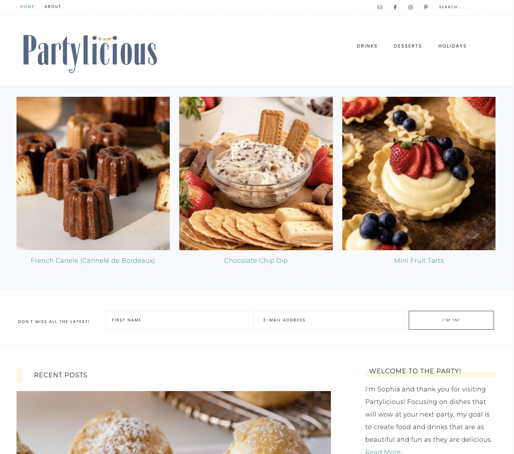

# Partylicious Food Blog

This repository contains the source code for Partylicious Food Blog front end, built using Next.js and using WordPress as a Headless CMS.

## Preview

<!-- [joemeersjankowski.com](https://joemeersjankowski.com) -->

## Features

- **Next.js**: The React framework for building efficient and interactive user interfaces.
- **TailwindCSS**: Utility-first CSS framework
- **WordPress Backend**: Using WordPress as a headless CMS to manage project lists
